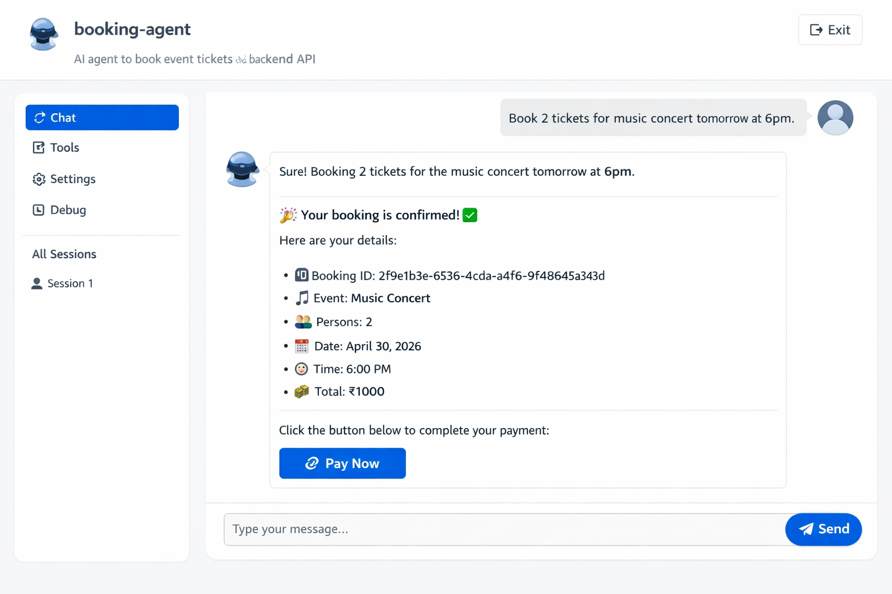

First go to fastapi and run it ,see fastapi folder and then follow below instruction:

# 🤖 Agentic AI Booking System (ADK)

## 📌 Overview

This project demonstrates an **Agentic AI system** that allows users to book event tickets using natural language.

Users can simply type:

> "Book 2 tickets for music concert tomorrow at 6pm"

The AI agent will:

* Understand the request
* Extract required details
* Call booking tool
* Generate payment link

---

## 🎯 Features

* 💬 Natural language booking
* 🧠 LLM-powered agent (Gemini / OpenAI)
* 🛠️ Tool-based execution
* 🔗 Payment link generation
* 🌐 ADK Web UI support

---

## 📁 Project Structure

```
ai-agent-booking/
│── agents/
│     ├── agent.py   (root_agent defined)
│── tools.py
```

---

## 🛠️ Tech Stack

* Google ADK
* Python 3.10+
* Gemini API (or OpenAI)

---

## ⚙️ Setup

### 1. Create Virtual Environment

```bash
python3.11 -m venv venv
source venv/bin/activate
```
### For Mac Specific
 ``` bash
 brew install python@3.11
 /opt/homebrew/bin/python3.11 -m venv venv
source venv/bin/activate
```
---

### 2. Install Dependencies

```bash
pip install google-adk fastapi uvicorn google-generativeai
```

---

### 3. Set API Key

```bash
export GOOGLE_API_KEY="your_api_key"
```

---

## ▶️ Run ADK Web

```bash
adk web . --port 8081
```

Open:

```
http://127.0.0.1:8081
```

---

## 🧪 Example Prompts

* "Book 2 tickets for music concert tomorrow at 6pm"
* "I want 3 tickets for tech conference on Friday"

---

## 🧠 How It Works

```
User Input
   ↓
LLM Agent (intent understanding)
   ↓
Tool Call (book_event)
   ↓
Booking Created
   ↓
Payment Link Generated
```

---

## 🔥 Supported Events

* 🎵 Music Concert (₹500)
* 💻 Tech Conference (₹1200)

---

## 💡 Future Enhancements

* Multi-step conversation
* Payment verification (Razorpay)
* Memory-based agent
* Deployment as SaaS

---

## 🚀 Use Cases

* AI automation tools
* Booking assistants
* Conversational commerce systems

---

## ⚠️ Notes

* Ensure correct model (e.g., gemini-2.0-flash)
* Enable billing if quota errors occur

---

## 📄 License

For educational and commercial prototyping use.

## 🤖 Agent UI Preview

Below is how the AI booking agent looks after a successful booking:




